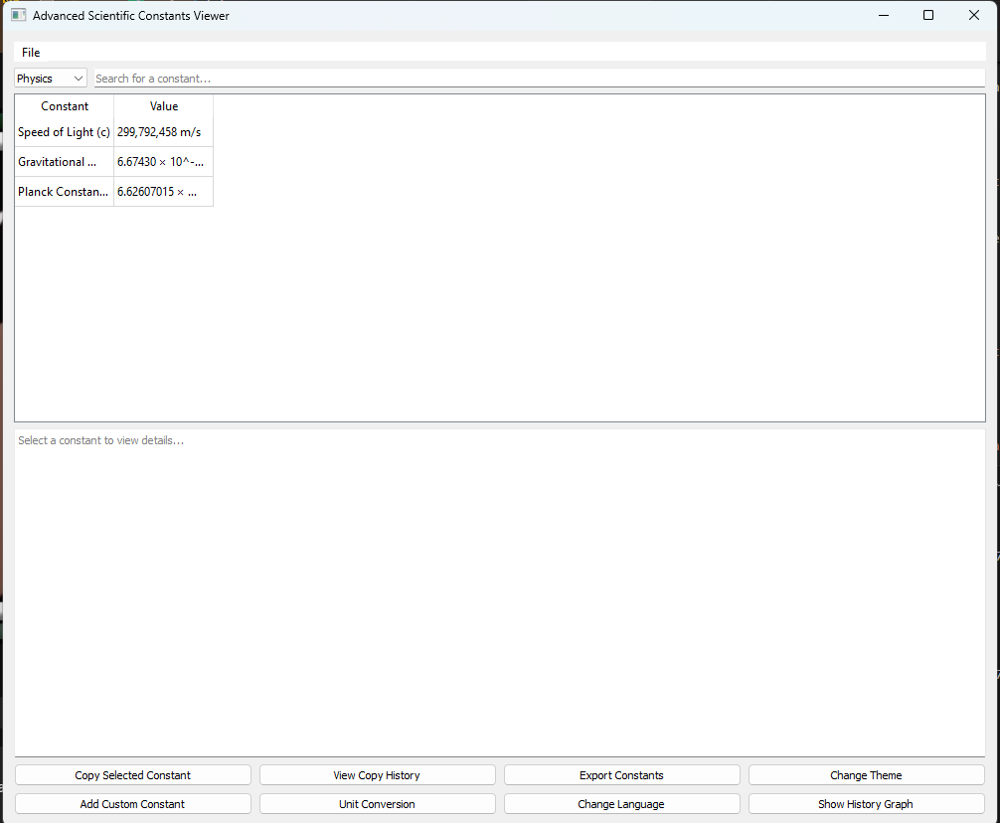

# Scientific Constants GUI

This is a Python-based GUI application that allows users to view and explore scientific constants categorized into different categories like Physics, Chemistry, etc. The application provides details such as the name, value, and description of each constant.

## Features

- **Categorized Constants**: Constants are grouped into categories such as Physics, Chemistry, etc.
- **Interactive GUI**: Built using PyQt5, the application provides a user-friendly interface.
- **Constant Details**: View details of each constant, including its value and a brief description.
- **Error Handling**: Gracefully handles missing data and invalid operations.

## Requirements

- Python 3.x
- PyQt5

## Installation

1. **Clone the repository**:

```bash
git clone https://github.com/Dumbo-programmer/Scientific-Constants.git
cd Scientific-Constants
```
2. **Install Dependencies**:
```bash
pip install PyQt5
```
Usage
1. Run the Application:
```bash
python main.py
```
2. Using the Application:

- Select a category from the dropdown menu.
- Click on a constant to view its details.
Screenshots: 



# Contributing
Contributions are welcome! If you'd like to add more constants, improve the UI, or fix bugs, feel free to open a pull request or raise an issue.

# License
This project is licensed under the MIT License - see the LICENSE file for details.
